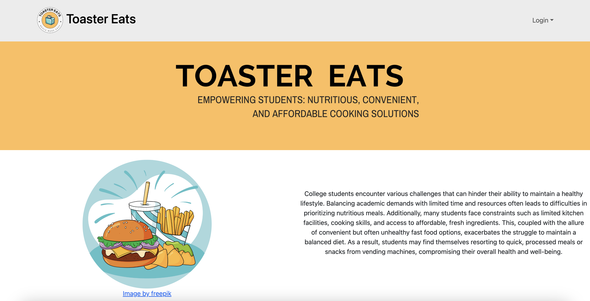
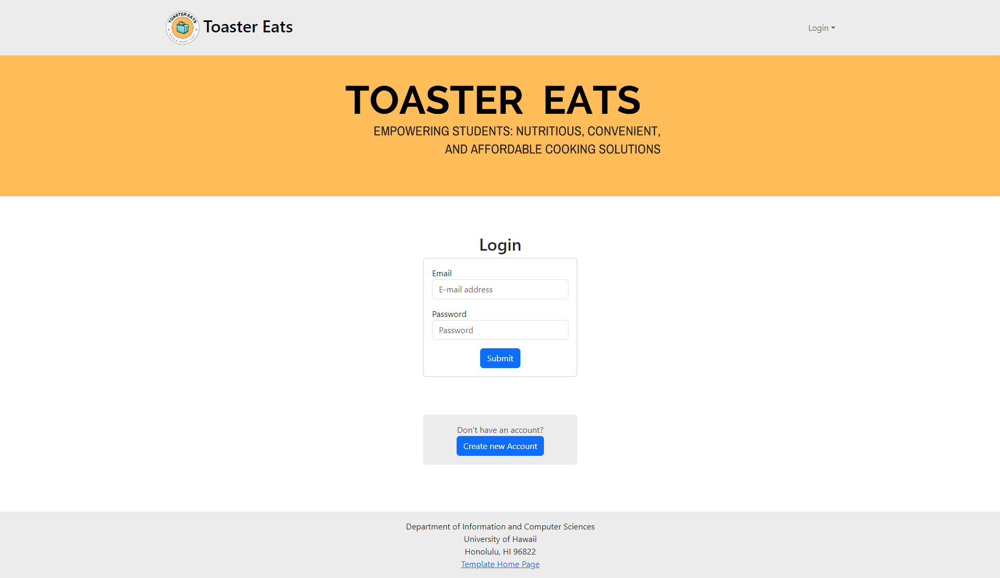
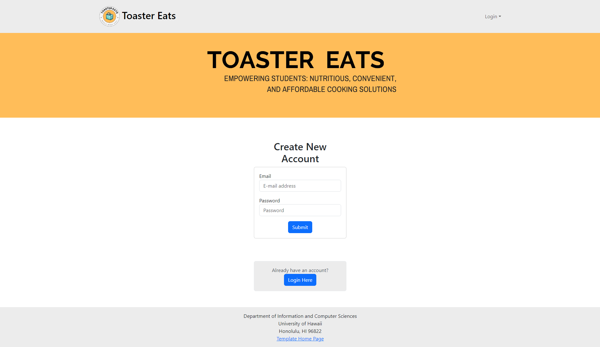
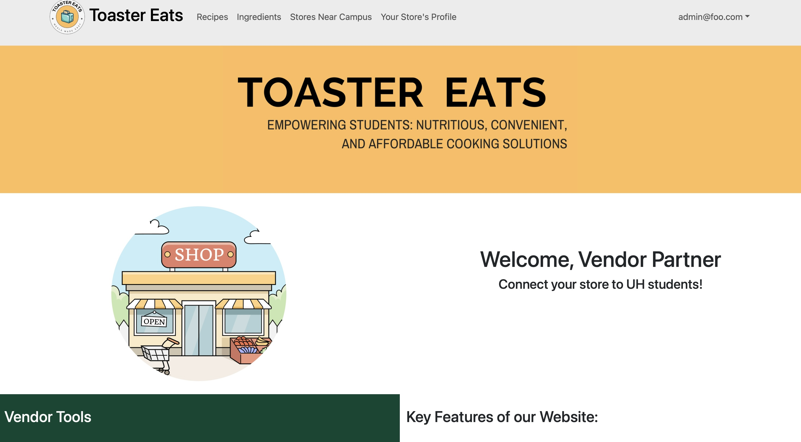
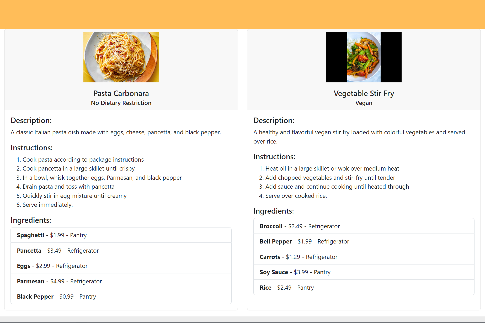

# [Toaster Eats](https://toaster-eats.github.io/)

## Table of contents

- [Overview](#overview)
- [Page Guide](#page-guide)
- [Live Deployment](#deployment)
- [Milestone 1](#milestone-1)
- [Milestone 2](#milestone-2)
- [Team](#team)

## Overview

Toaster Eats is an example web application that looks to improve the nutritional content and variety of foods eaten by students and help them limit the use of vending machines or fast food products by providing tasty, realistic alternatives. It illustrates various technologies useful to ICS software engineering students, including:

- [Meteor](https://www.meteor.com/) for Javascript-based implementation of client and server code.
- [React](https://reactjs.org/) for component-based UI implementation and routing.
- [React Bootstrap](https://react-bootstrap.github.io/) CSS Framework for UI design.

## Page Guide

This section provides a short description of each main page of Toaster Eats and its capabilities.

### Landing Page
The landing page gives users quick access to the rest of the site's pages with a side Nav Bar as well as presents an explanation of what the webapp is about along with the Logo.

### Login Page
The login page presents a login interface for users to login to their profiles as well as a quick way to go to the sign up page to create a new account.

### Sign Up Page
The sign up page allows new users to create a new account on Toaster Eats as well as a way to go back to the login page quickly.

### User Page
The User Page displays the User's profile picture as well as relevant user information (Tentative, content may be changed).

### Vendor Page
The Vendor Page has an additional navbar item to edit their store profile. It also has instructions geared towards the vendor, on how they can utilize toaster eats to market to students. 

### Recipe Page
The Recipe Page displays a photo of the food, instructions, ingredients, ingredient cost, ingredient location, and dietary restrictions if applicable (Tentative, content may be changed).

## Deployment
- Live Deployment: [Toaster Eats](http://64.23.255.151/)

## Milestone 1
> Click [here](https://github.com/orgs/Toaster-Eats/projects/2) to go to the Milestone 1 Project page!

## Milestone 2
> Click [here](https://github.com/orgs/Toaster-Eats/projects/3/views/1) to go to the Milestone 2 Project page!

## Team
> Team Contract: [View](https://docs.google.com/document/d/1n0IWih1ujnwyixrOLsx8WL_5SpSu6oZ7mWP9MzyGwqM/edit?usp=sharing)

## Organization
> Github Organization: [View](https://github.com/Toaster-Eats)
