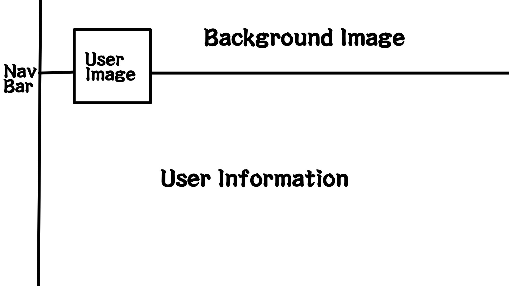
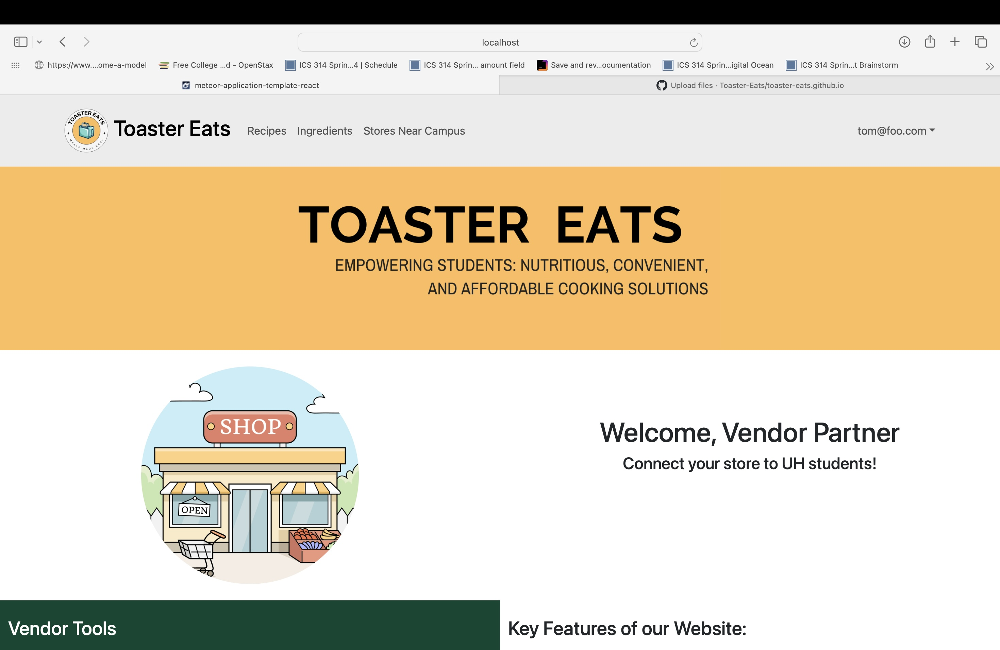
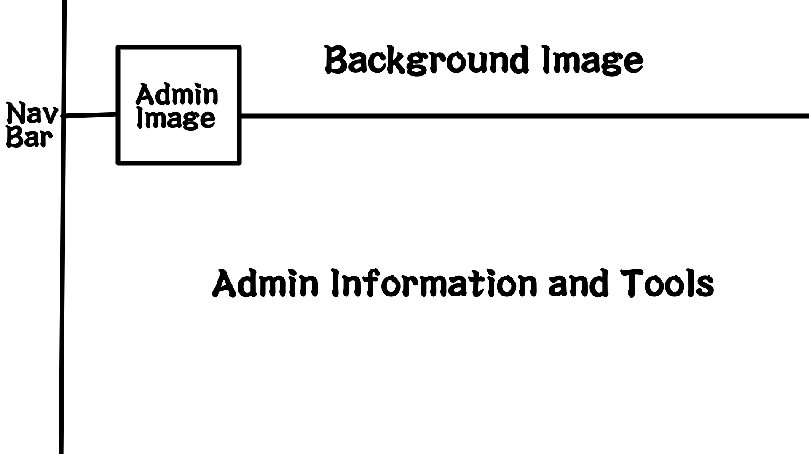

# [Toaster Eats](https://toaster-eats.github.io/)

## Table of contents

- [Overview](#overview)
- [Page Guide](#page-guide)
- [Live Deployment](#live-deployment)
- [Milestone 1](#milestone-1)
- [Milestone 2](#milestone-2)
- [Team](#team)

## Overview

Toaster Eats is an example web application that looks to improve the nutritional content and variety of foods eaten by students and help them limit the use of vending machines or fast food products by providing tasty, realistic alternatives. It illustrates various technologies useful to ICS software engineering students, including:

- [Meteor](https://www.meteor.com/) for Javascript-based implementation of client and server code.
- [React](https://reactjs.org/) for component-based UI implementation and routing.
- [React Bootstrap](https://react-bootstrap.github.io/) CSS Framework for UI design.

## Page Guide

This section provides a short description of each main page of Toaster Eats and its capabilities.

### Landing Page
The landing page gives users quick access to the rest of the site's pages with a side Nav Bar as well as presents an explanation of what the webapp is about along with the Logo.

### Login Page
The login page presents a login interface as well as a way to create a new user profile.

### User Page
The User Page displays the User's profile picture as well as relevant user information (Tentative, content may be changed).

### Vendor Page
The Vendor Page displays the Vendor's profile picture as well as relevant Vendor information (Tentative, content may be changed).

### Admin Page
The Admin Page displays the Admin's profile picture as well as relevant Admin information and access to Admin tools (Tentative, content may be changed).

## Live Deployment
- To be deployed to Digital Ocean

## Milestone 1
> Click [here](https://github.com/orgs/Toaster-Eats/projects/2) to go to the Milestone 1 Project page!

## Milestone 2
> Coming soon to a stone within a mile from you...

## Team

> Team Contract: [View](https://docs.google.com/document/d/1n0IWih1ujnwyixrOLsx8WL_5SpSu6oZ7mWP9MzyGwqM/edit?usp=sharing)
