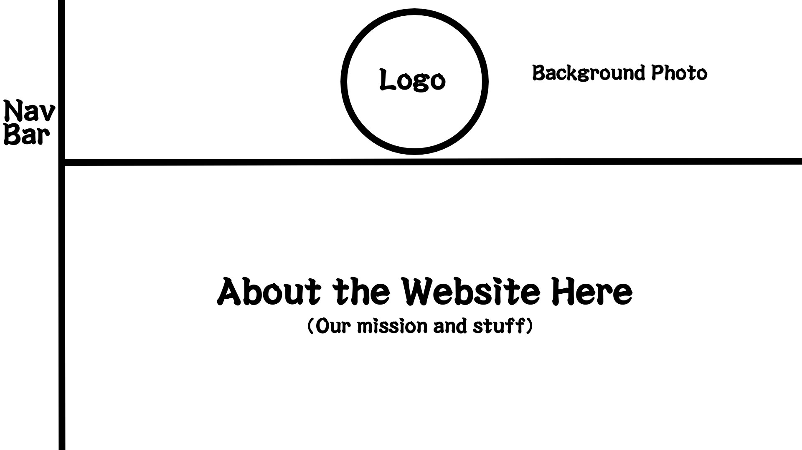

# Toaster Eats

## Table of contents

* [Overview](#overview)
* [Team](#team)

## Overview

Toaster Eats is an example web application that looks to improve the nutritional content and variety of foods eaten by students and help them limit the use of vending machines or fast food products by providing tasty, realistic alternatives. It illustrates various technologies useful to ICS software engineering students, including:

* [Meteor](https://www.meteor.com/) for Javascript-based implementation of client and server code.
* [React](https://reactjs.org/) for component-based UI implementation and routing.
* [React Bootstrap](https://react-bootstrap.github.io/) CSS Framework for UI design.

## User Guide

This section provides a short description of each main page of Toaster Eats and its capabilities.

### Landing Page
The landing page gives users quick access to the rest of the site's pages with a side Nav Bar as well as presents an explantion of what the webapp is about along with the Logo

## Team

Team Contract: [View](https://docs.google.com/document/d/1n0IWih1ujnwyixrOLsx8WL_5SpSu6oZ7mWP9MzyGwqM/edit?usp=sharing)
