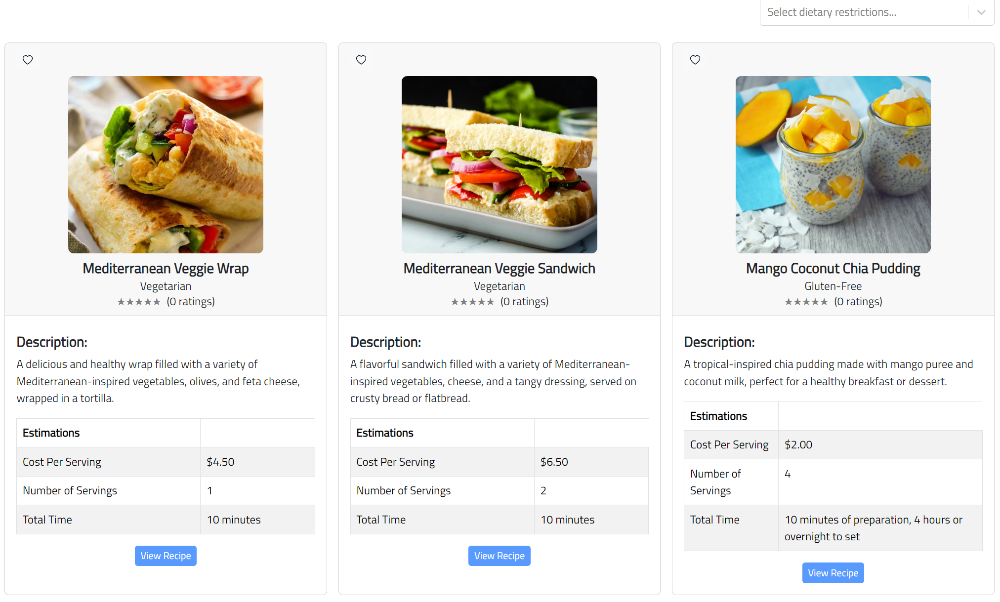
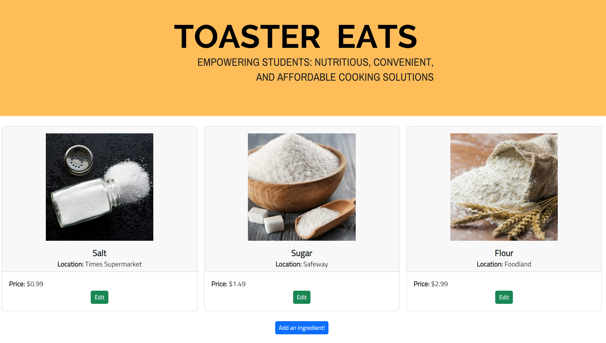

# [Toaster Eats](https://toaster-eats.github.io/)

## Table of contents

- [Overview](#overview)
- [Page Guide](#page-guide)
- [Live Deployment](#deployment)
- [Community Feedback](#community-feedback)
- [Developer Guide](#developer-guide)
- [Continuous Integration](#continuous-integration)
- [Milestone 1](#milestone-1)
- [Milestone 2](#milestone-2)
- [Milestone 3](#milestone-3)
- [Team](#team)

## Overview

Toaster Eats is an example web application that looks to improve the nutritional content and variety of foods eaten by students and help them limit the use of vending machines or fast food products by providing tasty, realistic alternatives. It illustrates various technologies useful to ICS software engineering students, including:

- [Meteor](https://www.meteor.com/) for Javascript-based implementation of client and server code.
- [React](https://reactjs.org/) for component-based UI implementation and routing.
- [React Bootstrap](https://react-bootstrap.github.io/) CSS Framework for UI design.

## User Guide

This section provides a short description of each main page of Toaster Eats and its capabilities.

### Home 
The landing page welcomes users to a a home page that encapsulates a mission-driven vision, addressing pertinent issues with junk food and cooking. From the captivating banner to the problem-solving narrative, key features, and sign-up button, users are invited to be part of the transformative journey.


### Signing In
The sign-in page offers users an interface to access login to existing accounts, alongside a button facilitating navigation to the sign-up page for creating new accounts.


### Registering a New Account
The sign-up page enables new users to register on Toaster Eats, providing a convenient option to swiftly return to the login page if needed.


### About Us
The About Us page provides a general outlook at the functionalities that Toaster Eats provides through recipe discovery, ingredient availability and navigating convenient meal solutions with constraints surrounding busy college student life.


### Weekly Picks
The This Week's Picks page presents three uniquely chosen recipes from the database, allowing for better recipe discoverability to finding meals that suit a user's current mood and readily available ingredients they may have for cooking.


### Viewing All Recipes
The Recipes page displays the each recipe with a photo, its name, dietary restrictions with a rating system that counts the number of reviews left on a recipe. Additionally, each recipe has a description, along with estimations for cost per serving, number of servings, and the total time it takes for preparing/cooking the meal.



### Viewing a Recipe
The View Recipe page allows for users to get an in-depth look at the full information for a recipe. On top of the previous components seen within the Recipes page, viewing a recipe allows users to see ingredient names, its cost, and location. It has a section for instructions from preparing and cooking a meal. Towards the bottom of the page, users may edit an exisiting recipe's information or delete them from the database altogether. 


### Add Recipe Page
The Add Recipe page provides a form for a user to add their own unique recipe into the database. Just like the recipe page, they may add an image of the food, cooking instructions, ingredients, ingredient cost, ingredient location and dietary restrictions (if applicable). 


### Edit Recipe Page
The Edit Recipe page provides a form for a user to edit an existing recipe. With this, users may change a recipe's image, its cooking instructions, ingredients, ingredient cost, ingredient location and dietary restrictions (if applicable). 


### Ingredients Page
The Ingredients page displays an image of the ingredient, its name, location, and price. An imminent feature would allow vendors to market their specific ingredient and make it easier for users to find what they need for a particular recipe. 



### Add Ingredient Page
The Add Ingredient page provides a form for users to add a new ingredient if it is not currently available within the database. 


### User Page
The User Page displays the User's profile picture as well as relevant user information (Tentative, content may be changed).


### Vendor Page
The Vendor Page has an additional navbar item to edit their store profile. It also has instructions geared towards the vendor, on how they can utilize toaster eats to market to students. 


## Deployment
Live Deployment: [Toaster Eats](https://toastereats.today/)

## Community Feedback
We're keen on hearing about your Toaster Eats experience! If you have a moment, kindly complete the [Toaster Eats Feedback Form](https://forms.gle/qZXzayayHETqoKrU6), which comprises just five brief questions. Your input will aid us in enhancing the system.

## Developer Guide
1. Install [Meteor](https://docs.meteor.com/install.html)

2. Visit the [Toaster-Eats github repository](https://github.com/Toaster-Eats/toaster-eats), and click the “Use this template” button to create your own repository initialized with a copy of this application. Alternatively, you can download the sources as a zip file or make a fork of the repo. However you do it, download a copy of the repo to your local computer.

3. cd into the bowfolios/app directory and install libraries with:
```
$ meteor npm install
```
4. Run the system with:
```
$ meteor npm run start
```
5. If successful, the application will appear at [http://localhost:3000](http://localhost:3000)

## Continuous Integration


Toaster Eats uses [GitHub Actions](https://docs.github.com/en/actions) to automatically run ESLint and TestCafe each time a commit is made to the default branch.

## Milestone 1
> Click [here](https://github.com/orgs/Toaster-Eats/projects/2) to go to the Milestone 1 Project page!

## Milestone 2
> Click [here](https://github.com/orgs/Toaster-Eats/projects/3/views/1) to go to the Milestone 2 Project page!

## Milestone 3
> Click [here](https://github.com/orgs/Toaster-Eats/projects/4/views/1) to go to the Milestone 3 Project page!

## Team
#### Team Members:
1. [Kenneth de Guzman](https://k-deguz.github.io/)
2. [Alexander Moshir](https://techfolio.moshir.dev/)
3. [Kenneth Seekins](https://kseekins.github.io/)
4. [Baishen Wang](https://baishenwang.github.io/)
5. [Christopher Yamada](https://citycoding.github.io/)
   
> Team Contract: [View](https://docs.google.com/document/d/1n0IWih1ujnwyixrOLsx8WL_5SpSu6oZ7mWP9MzyGwqM/edit?usp=sharing)

## Organization
> Github Organization: [View](https://github.com/Toaster-Eats)
